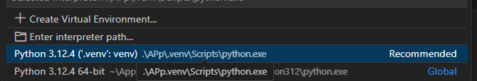

# HotReload

## Hot Reload for automatically refreshing browser when saving web files

# Project

* Python 3.12.4
* 2nd thing
* third thing

# Setup

* clone the repo
* create virtual environment
* install requirements.txt

```
git clone https://github.com/TheRealSyalin/HotReload.git
pip3 install pipreqs
```



```
pipreqs -r path\to\requirements.txt
```

# Use

(Recommended)
```
python HotReload.py C:\Users\User\MyWebsite
```

## or

```
python HotReload.py
```

