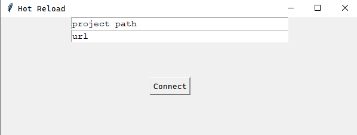

# HotReload

## Hot Reload for automatically refreshing browser when saving web files

# Project

* Python 3.12.4
* Windows only ftm
* third thing

# Setup

* clone the repo
* create virtual environment
* install requirements.txt

```
git clone https://github.com/TheRealSyalin/HotReload.git
pip3 install pipreqs
```


```
pipreqs -r path\to\requirements.txt
```

# Use

(Recommended)
```
python HotReload.py C:\Users\User\MyWebsite
```

## or

```
python HotReload.py
```



# Build

* install pyinstaller
* run and configure pyinstaller command

```
pip install pyinstaller
pyinstaller --noconsole -F HotReload.py
```

# distribution

in App\dist is an exe and bat file. you can add the bat file to PATH and run the commands


```
hreload run path\to\projectfiles
hreload run
```

```
hreload stop
```
